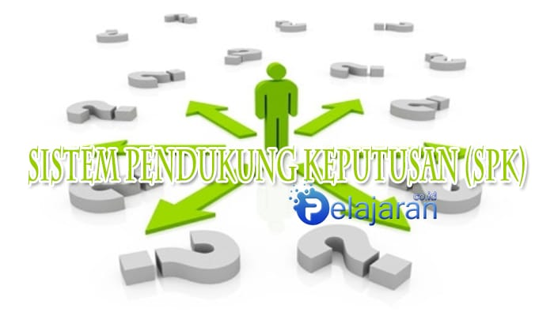

<html>
<head>
	<title>WEBSITE Tugas SPK</title>
	<link rel="stylesheet" type="text/css" href="style web.css">
</head>
<body>
	
	<!-- bagian header template -->
	<header>
		<h1 class="judul">Tugas WEBSITE Sistem Penunjang Keputusan</h1>
		
(SPK)

	</header>
	<!-- akhir bagian header template -->
	
	

		<!-- bagian menu		 -->
		<nav class="menu">
			<ul>
				<li>
					<a href="#">Home</a>
				</li>
				<li>
					<a href="#">Profile</a>
				</li>
				<li>
					<a href="#">Galeri</a>
				</li>
                <li>
					<a href="#">Kontak</a>
				</li>
			</ul>
		</nav>
		<!-- akhir bagian menu -->
 
		<!-- bagian sidebar website -->
		<aside class="sidebar">
			

				<h2>Nama Kelompok</h2>
				
Muhammad Rifki ; 191106041400

				
Saga ; 191106041386

				
Aditia ; 191106041384

			

		</aside>
		<!-- akhir bagian sidebar website -->
 
		<!-- bagian konten Blog -->
		

			

				
				<h1> Pengertian Sistem Penunjang Keputusan </h1>
				

				

					Sistem Pendukung Keputusan (SPK) atau decision support systems (DSS) merupakan bagian dari sistem informasi berbasis komputer (termasuk berbasis pengetahuan) yang dipakai untuk mendukung pengambilan keputusan dalam suatu organisasi atau perusahaan.
				
				
				<a href="#" class="continue-lendo">Selengkapnya →</a>
			

			

				
				<h1> PENERAPAN METODE SIMPLE ADDITIVE WEIGHTING (SAW) PADA SISTEM SELEKSI PENERIMAAN CALON SISWA BARU (STUDI KASUS: SMK NEGERI 1 CIREBON)</h1>
				

				<h2>Simple Additive Weighting(SAW)</h2>
				

					Metode Simple Additive Weighting (SAW) dikenal juga sebagai kombinasi linear atau metode pembobotan skor, yaitu teknik pengambilan atribut sederhana dan paling sering di gunakan. Metode ini didasarkan pada rata-rata pembobotan. Skor evaluasi dihitung untuk setiap alternatif dengan mengalikan nilai skala yang diberikan kepada alternatif bahwa atribut dengan bobot kepentingan relatif diberikan langsung oleh pengambil keputusan diikuti dengan menjumlahkan produk untuk semua kriteria. Keuntungan dari metode ini adalah perubahan linear proporsional data mentah yang berarti bahwa urutan relatif besarnya nilai standar tetap sama.
				

				<h2>Menentukan kriteria</h2>
				

					Berdasarkan keputusan panitia pendaftaran di sekolah SMK Negeri 1 Cirebon yang diambil dari referensi Petunjuk Teknis PPDB 2015 Online Untuk SMK, dilakukan berdasarkan pada :
					
1.	Nilai Mata Pelajaran yang terdapat pada Sertifikat Hasil Ujian Nasional (SHUN) yaitu : Nilai Matematika, Nilai Bahasa Inggris, Nilai Ilmu Pengetahuan Alam, dan Nilai Bahasa Indonesia.

					
2.	Nilai tes kesehatan untuk pertimbangan PPDB SMK diserahkan ke sekolah yang bersangkutan.

					
3.	Jika nilai akhir pada poin 1, pada batas maksimum daya tampung (passing grade) sama, maka dilakukan urutan langkah seleksi yaitu perbandingan Nilai Hasil Ujian Sekolah (SHUS) / Sertifikat Hasil Ujian Nasional (SHUN) setiap mata pelajaran yang lebih besar dengan urutan nilai mata pelajaran Matematika, Bahasa Inggris, Ilmu Pengetahuan Alam, dan Bahasa Indonesia.

					
					
					
					
					
				

				<a href="#" class="continue-lendo">Selengkapnya →</a>
			

		

		<!-- akhir bagian konten Blog -->
	

 
</body>
</html>
